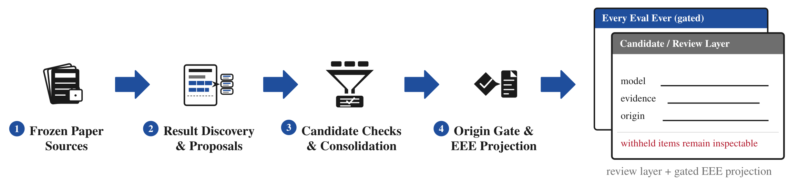

# Proceedings to Every Eval Ever

Proceedings-to-EEE turns evaluation results reported in scientific papers into
structured candidate observations and, when every required fact can be verified,
[Every Eval Ever (EEE)](https://github.com/evaleval/every_eval_ever) JSON.
Each observation keeps the reported value tied to the evaluated system, dataset and
scope, metric, paper location, and source evidence. External, ambiguous, or
unsupported results remain available for review.

The model proposes candidate observations. Local code checks page-local textual
support, typed completeness, internal consistency, physical-cell conflicts, and the
producer-origin policy. It composes EEE only after every export gate passes.

The current release runs end to end through candidate discovery and review reporting.
Its automatic origin resolver can demote or abstain, but it cannot establish
`paper_produced`. The reported development run therefore emitted no canonical EEE
records. Human review supports inspection and measurement. Review decisions are
stored separately and are not imported to promote candidates or recompose EEE.



*Code freezes source inputs and plans result-bearing regions and rows. Models propose
block candidates and optional row dispositions. Code checks support, completeness,
consistency, cell identity, and origin cues. The review layer preserves withheld
items, while EEE remains a gated projection. The vector
[PDF](assets/proceedings-to-eee-pipeline.pdf) and
[LaTeX source](assets/proceedings-to-eee-pipeline.tex) are included.*

## What the pipeline produces

| Output | Contents |
| --- | --- |
| Candidate observations | Typed, nullable proposals for a reported value and its system, dataset and scope, metric, setting, and page-bound evidence. A primary result needs the complete tuple before export |
| Candidate and review layer | Supported and unsupported proposals, external results, conflicts, abstentions, row dispositions, and explicit reasons for review |
| Canonical EEE | Deterministic EEE 0.2.2 records containing only observations that pass every evidence, semantics, origin, and export gate |
| Extraction Review Cards | Paper and corpus views of candidates, withheld items, provenance status, and run health. These are extraction reports, not Evaluation Cards |
| Run and evaluation summaries | Quote-free aggregate counts, coverage diagnostics, failures, cost telemetry, and measurements tied to a declared development or holdout split |

The local research record retains exact evidence, source manifests, conflicts,
provider metadata, and review decisions. The public repository excludes paper PDFs,
evidence quotations, raw provider payloads, credentials, request identifiers, private
annotations, and local run directories.

## Pipeline

### 1. Freeze the source set

Each paper receives a source manifest. Downloaded paper and supplement files retain
their content hash, final URL, timestamp, media type, source role, access state, and
license disposition. A repository source records its URL and declared commit. The
current workflow does not clone and rehash the remote repository tree.

### 2. Recover page and result structure

The parser preserves page boundaries and horizontal text layout from selected pages
of the primary paper PDF. It identifies bounded result regions while retaining nearby
headers, captions, table labels, line coordinates, and separable column ranges. It
does not digitize values from plotted figures or search the complete paper for origin
evidence. The fragment interface can accept a richer parser without changing the
downstream observation model.

### 3. Propose candidate observations

A source-scoped model call sees one bounded result region and returns a strict wire
schema. Its typed fields are nullable. The response includes a page-bound evidence
quotation plus optional table, row, and column labels. This stage proposes
observations. It cannot write EEE records or change source data, schemas, prompt
templates, or code.

### 4. Enumerate dense table rows

Dense-table enumeration is optional. It considers layout-indexed data rows inside
dense tables that intersect the already selected result-block bodies. Code builds
stable table and row identities, then sends small batches with their caption, headers,
row label, columns, cells, and evidence coordinates. Every batchable row must return
one model disposition, `result`, `not_result`, or `uncertain`. Missing or malformed
dispositions enter a bounded split-recovery path. Over-limit rows remain visible as
unbatchable review items. Disposition coverage is a run-health measure, not a measure
of row-disposition accuracy.

### 5. Check page-local textual support

The evidence quotation and raw value must occur on the declared source page after
limited normalization of whitespace, non-breaking spaces, minus signs, and numeric
formatting. The verifier records the occurrence count instead of selecting one match
silently. Unsupported values remain in the candidate ledger and cannot enter
canonical EEE.

### 6. Check tuple fields and physical cells

Code checks that required core tuple fields are present and applies limited internal
consistency checks to system role, dataset, metric family, direction, unit, and scale.
Optional subset, setting, and metric-parameter fields are type-checked when supplied.
Most names and scope assignments remain model-proposed. Exact metric aliases fill
only unambiguous metric semantics. Identity and complete-tuple correctness still
require human measurement.

For table evidence, code binds a unique printed raw-value token to its region, row,
ordinal, and layout coordinates. Generated column wording never establishes physical
identity. Proposals bound to the same printed cell merge, equal values in distinct
cells remain distinct, and ambiguous alternatives stay available for review.

### 7. Check producer-origin cues

Producer origin is separate from the model's reported result type. The current
resolver checks structural cues around the candidate's first evidence anchor. Only a
located table-row anchor can produce a row-cue verdict. It can identify some
externally sourced rows or return `unresolved` or `no_signal`. It does not search
off-page methods evidence and never promotes `no_signal` to paper-produced origin.

A complete origin workflow needs separate page-bound result evidence and origin
evidence, since a table and the methods sentence establishing who ran an evaluation
may appear on different pages. That positive-origin path remains to be implemented.

### 8. Gate and compose EEE

Canonical export requires positive paper-produced origin, primary-result status,
explicit system, dataset, metric, scope and value, verified source support, resolved
metric direction and scale, sufficient confidence, and no unresolved conflict.
Externally sourced, unsupported, ambiguous, or incomplete observations stay in the
review layer. Eligible observations are grouped by evaluated system and projected
into EEE by deterministic code.

Each numeric EEE result retains a quote-free source anchor with the paper and source
identity, page, table or prose location, row and column when available, and the
evidence hash. Full evidence remains in the local sidecar.

### 9. Validate, review, and publish

The composer validates each record against the pinned EEE schema and checks that the
declared schema version agrees with the schema metadata. Paper reports expose all
accepted and withheld candidates, including papers with no candidates or no EEE
output. Human reviewers can inspect evidence, origin, conflicts, and omissions. Their
decisions support measurement and development, but the current workflow does not
import them as approvals for canonical composition.

Public snapshots are built through an explicit field allowlist. They can contain
quote-free EEE, review summaries, aggregate measurements, and checksums. Private
sources, evidence text, paper-bearing provider request payloads, provider responses,
annotations, and local paths remain outside the snapshot. Static prompt templates are
part of the public source code.

## Validation

No single score establishes that extracted records follow their papers. The pipeline
keeps textual support, tuple completeness, internal consistency, physical-cell
binding, producer origin, and export eligibility as separate states.

| Gate | Question answered |
| --- | --- |
| Source replay | Do downloaded paper and supplement bytes match their hashes, and does a repository source retain its declared URL and commit? |
| Candidate contract | Did the extractor return the required typed fields without unknown or malformed content? |
| Page-local textual support | Do the normalized evidence quotation and raw value occur on the declared source page, and how many times? |
| Tuple completeness and consistency | Are required core tuple fields present and internally consistent, and are optional subset, setting, and metric-parameter fields well formed when supplied? |
| Physical-cell identity | Do duplicate proposals refer to one physical table cell, and are genuinely distinct cells preserved? |
| Conflict and safety checks | Do evidence-sharing candidates disagree about the system, metric, value, or scope? |
| Producer origin | Is there positive evidence that the current paper produced the result? |
| Export policy | Does the observation satisfy every requirement for canonical EEE rather than the review layer? |
| EEE schema | Does the deterministic projection validate against the pinned EEE schema and matching version? |
| Completeness and review | Are unresolved rows, zero-candidate papers, zero-EEE papers, and technical failures visible? |
| Human evaluation | Are review decisions kept separate from extraction, and are claims limited to the annotated denominator? |
| Public release | Does the snapshot exclude quotations, credentials, paths, request IDs, provider traces, and private annotations? |

## Source and evidence roles

Sources enter the workflow according to what they can establish.

| Source | Role | Constraint |
| --- | --- | --- |
| Primary paper PDF | Text and layout from selected pages, including result statements, tables, and captions | Extraction is page-addressed and does not digitize visual figure values or search the full paper for origin evidence |
| Supplementary material | Additional results, definitions, and settings | Stored as a separate immutable source with its own provenance |
| Associated repository or artifact | Potential result files, configurations, and protocol details | The manifest records a URL and declared commit. The current workflow does not clone or verify the remote tree |
| Publisher and venue metadata | Paper identity, venue, year, and source discovery | Discovery metadata does not establish reported results by itself |
| Human annotations | Development diagnosis and future independent evaluation | Labels stay outside extraction prompts and cannot silently change a sealed run |
| EEE schema | Output structure and validation target | The schema defines the destination format. It is not evidence for a paper result |

The current parser mines selected text-layout pages from the primary PDF. Supplement
files can be frozen, and repository identity can be recorded, but automated extraction
adapters for those sources remain a separate implementation path.

## What has been measured

The available results describe candidate discovery and run behavior. They do not yet
establish unattended paper-to-EEE accuracy.

| Measurement | Result | Interpretation |
| --- | ---: | --- |
| Sealed ten-paper holdout | `5/10 = 0.5` selected targets | Untouched selected-target recall, one audited target per paper |
| Same papers after inspection | `7/10 = 0.7` selected targets | Post-hoc diagnostic after a generic composition fix and bounded technical retry |
| Current development extraction | `380/380` selected result blocks completed | Every block completed, resumed, or recovered without a terminal block failure |
| Dense-row plan | `315/334` typed dispositions | Typed disposition coverage only. 17 rows remain unresolved and two are explicitly unbatchable |
| Candidate consolidation | `1,297 -> 1,078` | 219 duplicate proposals were removed |
| Candidate and export status | 1,055 review, 23 not eligible, 0 canonical EEE | No candidate had positive `paper_produced` origin, so none passed every canonical gate |
| Development reference recall | `106/109 = 0.972477` micro, `0.7` macro | Candidate-layer recall over pre-existing development references |

The development-reference denominator is not a whole-paper gold standard. The result
is not precision, canonical-EEE recall, holdout evidence, or evidence of
generalization. Precision, complete-tuple correctness, non-result-row specificity,
origin accuracy, and current-version performance on unseen papers remain unmeasured.

The present producer-origin resolver can demote or abstain. It cannot yet positively
establish paper-produced origin from separate result and methods evidence. Empty
canonical output is therefore the safe current behavior, even when the review layer
contains useful candidates.

Current human evidence is limited to a single-reviewer exploratory check. There is
no second annotator, adjudication, agreement estimate, or independent human
validation. Its 53 sampled items are numeric result-table body rows and contain no
genuine negative cases. A future measurement needs a predeclared mixed sample with
separate result and origin evidence fields.

The quote-free [development summary](results/current-development-summary.json) records
the candidate, row, attribution, run-health, and provider-usage breakdown.

## Examples

| Artifact | What it illustrates |
| --- | --- |
| [Synthetic Extraction Review Card](examples/quickstart/synthetic-extraction-review-card.html) and [JSON](examples/quickstart/synthetic-extraction-review-card.json) | A generated, source-free example with one withheld candidate, structured abstention reasons, zero EEE records, and no evidence quotation |
| [Synthetic EEE](examples/quickstart/synthetic-eee.json) | A small schema-valid EEE record with a quote-free source anchor. It checks installed-package validation, not extraction quality |
| [Current development summary](results/current-development-summary.json) | Aggregate run health, row dispositions, candidate and export counts, attribution states, development recall, usage, and limitations without paper text or private labels |

## Repository and code

```text
assets/                         TikZ pipeline figure and rendered PDF/PNG
configs/                        Deterministic attribution cues
docs/                           Architecture, evaluation status, and annotation design
examples/quickstart/            Corpus template and synthetic review/EEE examples
results/                        Quote-free development aggregate
schemas/eee-0.2.2/              Pinned EEE schema and license
src/proceedings_to_eee/         Pipeline, CLI, validation, reporting, and replay code
tests/                          Offline deterministic tests and synthetic fixtures
```

Private paper sources and local run records stay outside the public repository.

## Install and inspect

Requirements are Python 3.12, [`uv`](https://docs.astral.sh/uv/), and Poppler
(`pdftotext`) for PDF processing.

```bash
UV_CACHE_DIR=/tmp/ere-uv-cache uv sync --frozen --group dev
UV_CACHE_DIR=/tmp/ere-uv-cache uv run --frozen ere --help
UV_CACHE_DIR=/tmp/ere-uv-cache uv run --frozen \
  ere validate-eee examples/quickstart/synthetic-eee.json
```

The expected validation result is schema `0.2.2` with an empty `issues` list. The
wheel contains the same pinned schema and attribution lexicon, so validation and
attribution work outside the repository checkout.

Run the deterministic checks with the following commands.

```bash
UV_CACHE_DIR=/tmp/ere-uv-cache uv run --frozen pytest -q -p no:cacheprovider
UV_CACHE_DIR=/tmp/ere-uv-cache uv run --frozen ruff check --no-cache .
UV_CACHE_DIR=/tmp/ere-uv-cache uv run --frozen ruff format --check --no-cache .
UV_CACHE_DIR=/tmp/ere-uv-cache uv build
```

## Run extraction

Provider-backed extraction is explicit and incurs external cost. Keep
`OPENROUTER_API_KEY` in a local environment or gitignored `.env`.

Copy [the corpus template](examples/quickstart/corpus-template.yaml), replace the
example paper metadata and PDF URL, then run the resulting development corpus.

```bash
uv run ere run-corpus my-development-corpus.yaml \
  --model google/gemini-3.5-flash-lite \
  --output runs/my-development-run \
  --row-enumeration
```

Corpus files declare their evaluation split. Public development summaries accept
only a development-bound run. Holdout or unclassified runs are rejected. Before a
paid resume, use `ere plan-row-enumeration` against the compatible frozen run to
inspect reusable work, maximum structured calls, transport ceilings, and estimated
cost.

After a development run, build the public aggregate offline.

```bash
uv run ere build-public-development-summary runs/my-development-run \
  --output results/current-development-summary.json
```

The summary builder rechecks the development binding, row ledger, candidate counts,
origin policy, and privacy allowlist. It reports bounded incompleteness rather than
turning unresolved work into a successful extraction.

## Contributing

Useful contributions include better table structure recovery, page-bound result and
origin evidence, positive producer-origin decisions, synthetic fixtures, review
workflows, and evaluation sets with real negative and mixed cases. See
[architecture](docs/architecture.md),
[evaluation status](docs/evaluation-status.md), and
[annotation method](docs/annotation-method.md) for the current interfaces and claim
boundaries.

## License

The software is available under the root [MIT license](LICENSE). The bundled EEE
schema retains its own [MIT license](schemas/eee-0.2.2/LICENSE).
